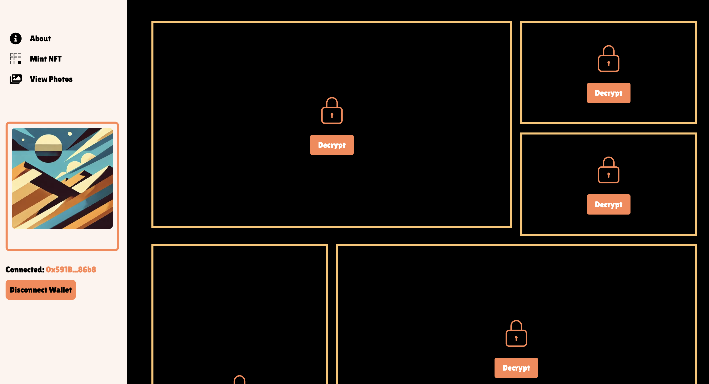

# Project Overview

This project uses [TACo]([https://docs.threshold.network/](https://docs.threshold.network/applications/threshold-access-control)) and [Irys](https://docs.irys.xyz/) to build a decentralized token gating system.

Five images are encrypted with TACo and stored permanently on-chain using Irys. To decrypt the images, users must sign a transaction proving they own with a specific NFT. For the demo, the NFT can be minted for free by anyone, although you will need some SEPOLIA ETH to cover gas fees.

## Sub-projects

- [`/server-encryptor-project`](./server-encryptor-project/README.md) - A NodeJS script that encrypts images from the local drive. Can be customized to encrypt any data or symmetric key.
- [`/contract-project`](./contract-project/README.md) - The NFT smart contract. Wallets that hold this NFT can decrypt the images.
- [`/ui-project`](./ui-project/README.md) - The token gating UI. The UI is open to anyone, but the content can only be decrypted by NFT holders.

## Token-Gating

Token gating ensures that only individuals possessing a specific NFT or ERC20 token can access certain content. Unlike traditional token-gating platforms that restrict access to a centralized UI, decentralized environments require a different approach. In a decentralized setup where content is stored on-chain and publicly accessible, locking the UI is ineffective as users can directly access the on-chain content.

For decentralized token gating, data must be encrypted before storing it on-chain. Only the holders of certain tokens should be able to decrypt this data, ensuring that unauthorized users cannot access the content even if they manage to bypass the UI restrictions.

## Benefits of Decentralized Token Gating

- **Enhanced Security**: Encrypting data ensures that only authorized token holders can access the content, maintaining privacy and security.
- **Decentralized Control**: No reliance on a central authority or permissioned group to manage access, who can easily decrypt the private data themselves or ignore access requests. 
- **Permanent Access**: Encrypted data stored on-chain can remain accessible to token holders indefinitely, ensuring long-term data availability.

## TACo (Threshold Access Control)

TACo enables end-to-end encrypted data sharing and communication without requiring trust in a centralized authority. It achieves this by distributing sensitive cryptographic operations across a network of independent nodes. This decentralized approach is crucial for:

- **Key Generation and Conditions-Based Decryption**: These processes are handled by a distributed set of independent machines, signficantly reducing the risk of unauthorized access or a single point of failure event.
- **Granular Access Control**: Only users who meet specific conditions (e.g. holding a particular NFT) are provisioned with decryption material, providing fine-grained control over data access. No other party can reassemble the decryption material, ensuring shared data remains end-to-end encrypted. 
- **High Redundancy, Low Latency**: TACo's threshold cryptosystem and low-latency decryption flow ensures reliable and rapid access to encrypted data, making it practical for real-time applications.

## Irys

Irys enables permanent onchain data. Data on Irys is permanent, precise, and unconstrained.

- **Permanent**: Data stored on Irys is censorship-resistant and immutable. There's no counterparty risk of data being removed.
- **Precise**: Data is timestamped with a high-precision timestamp, providing a reliable sequence of events.
- **Unconstrained**: There are no limits on file upload sizes. Users can always read, write, and discover data at scale.

Irys offers near-instantaneous uploads. After uploading, the data is immediately available for download.

By integrating TACo with Irys, users can leverage Irys' fast upload and data egress capabilities alongside TACo's secure encryption and decryption, ensuring that sensitive data remains private and accessible only to those with the appropriate tokens. This combination offers a robust solution for secure, decentralized token gating in various applications.
